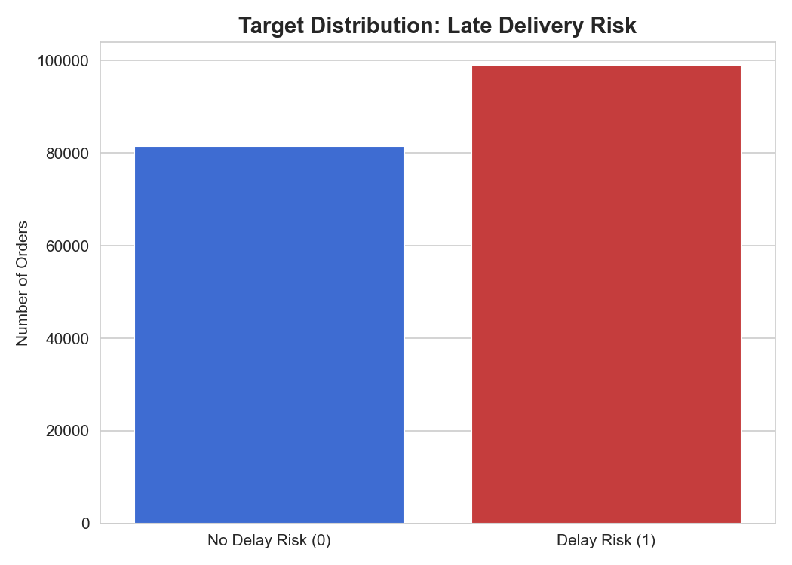
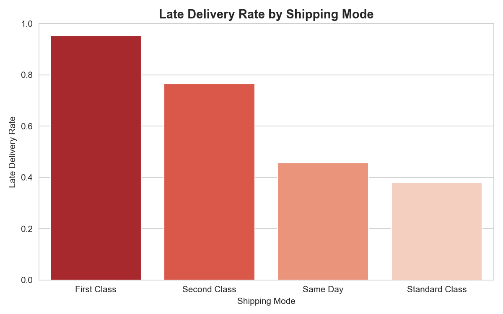
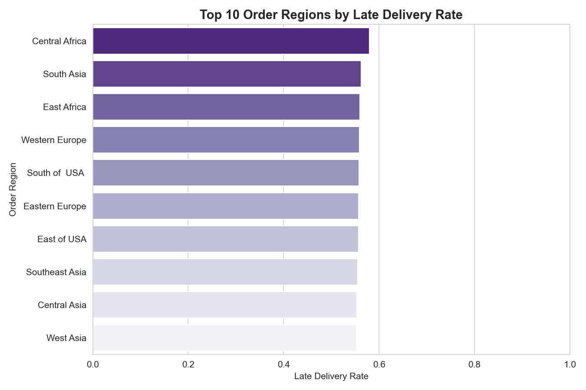

<div align="center">

# 🚚 ShipSense

### <span style="color:#1e3a5f">AI-Powered Shipping Delay Prediction System</span>

<b>Predict late deliveries before they happen — powered by a PyTorch deep learning model, served through an interactive Streamlit app.</b>


</div>

---

## 🔗 Live Demo

> **👉 Add your deployed Streamlit Cloud / HuggingFace Spaces link here:**
> ### <a href="#" target="_blank">https://shipsense-v2-pytorch.streamlit.app/</a>

---

## 📌 Overview

<blockquote>
<b>ShipSense</b> is an end-to-end machine learning system that predicts the probability a shipment will
<b><span style="color:#e5484d">arrive late</span></b>, using order, product, customer, and logistics attributes available
at the moment an order is placed. It turns a trained deep learning model into a production-style,
interactive web application — not just a notebook.
</blockquote>

<table>
<tr><td>🎯 <b>Task</b></td><td>Binary classification — Late Delivery Risk (0 / 1)</td></tr>
<tr><td>🧠 <b>Model</b></td><td>Feed-forward Neural Network (PyTorch), tuned with Optuna</td></tr>
<tr><td>📊 <b>Dataset</b></td><td>180,000+ historical shipment records, 27 engineered features</td></tr>
<tr><td>🖥️ <b>Interface</b></td><td>Multi-page Streamlit app — single & batch (CSV) prediction</td></tr>
</table>

---

## ✨ Features

- 🔮 **Single-shipment predictor** — fill a form, get an instant risk score with a live gauge chart
- 📁 **Batch prediction** — upload a CSV of shipments and download scored results
- 📊 **Insights & EDA tab** — dataset stats and the exploratory charts generated during training
- 🧠 **Model Info tab** — architecture, tuned hyperparameters, and preprocessing pipeline, in-app
- 🎨 **Polished, responsive UI** — custom styling, color-coded risk bands, no notebook clutter

---

## 🖼️ Screens & Visuals

<table>
<tr>
<td width="50%"></td>
<td width="50%"></td>
</tr>
<tr>
<td width="50%"></td>
<td width="50%"></td>
</tr>
</table>

<sub>All charts are also viewable live inside the app's <b>📊 Insights & EDA</b> tab.</sub>

---

## 🧩 How It Works

```
Raw shipment input (Streamlit form / CSV)
            │
            ▼
   Ordinal-encode categorical columns   (fitted encoder.pkl)
            │
            ▼
   Standard-scale full feature row      (fitted scaler.pkl)
            │
            ▼
   PyTorch feed-forward network         (shipsense_model.pth)
            │
            ▼
   Sigmoid → P(late delivery) → Risk band (🟢 Low / 🟠 Moderate / 🔴 High)
```

---

## 📂 Project Structure

```
ShipSense/
├── app.py                      # Streamlit app entry point
├── requirements.txt            # Python dependencies
├── src/
│   ├── model.py                # Neural network architecture (PyTorch)
│   ├── preprocessing.py        # Artifact loading + encode/scale pipeline
│   ├── inference.py            # Model loading + prediction
│   └── utils.py                # Risk banding, EDA helpers
├── models/                     # Trained model + fitted encoder/scaler (.pkl / .pth)
├── data/                       # Training data + column metadata
├── graphs/                     # EDA charts generated during training
└── notebooks/                  # Original training / experimentation notebook
```

---

## 🚀 Getting Started

**1. Clone & enter the project**
```bash
git clone <your-repo-url>
cd ShipSense
```

**2. Create a virtual environment (recommended)**
```bash
python -m venv venv
source venv/bin/activate      # Windows: venv\Scripts\activate
```

**3. Install dependencies**
```bash
pip install -r requirements.txt
```

**4. Run the app**
```bash
streamlit run app.py
```

The app opens at **http://localhost:8501** 🎉

---

## 🎯 Use Cases

| Use Case | Who Benefits |
|---|---|
| Flag high-risk orders at checkout for proactive customer messaging | E-commerce / D2C teams |
| Re-route or upgrade shipping for at-risk orders before dispatch | Logistics & fulfillment |
| Feed risk scores into support/SLA dashboards | Customer support |
| Score historical or incoming order feeds in bulk via CSV | Data & analytics teams |
| Benchmark carrier / shipping-mode reliability | Supply chain planning |

---

## 🛠️ Tech Stack


---

## 🗺️ Roadmap

- [ ] Add SHAP-based per-prediction explainability
- [ ] Model versioning / experiment tracking (MLflow)
- [ ] REST API endpoint (FastAPI) alongside the Streamlit UI
- [ ] Dockerfile for one-command deployment

---

## 👤 Author

**Rohit Jha**
🔗 GitHub: [Rohit-coder-py](https://github.com/Rohit-coder-py) · 🔗 LinkedIn: [rohit-jha-ai](https://linkedin.com/in/rohit-jha-ai)

---

<div align="center">
<sub>⭐ If you find this project useful, consider starring the repo!</sub>
</div>
