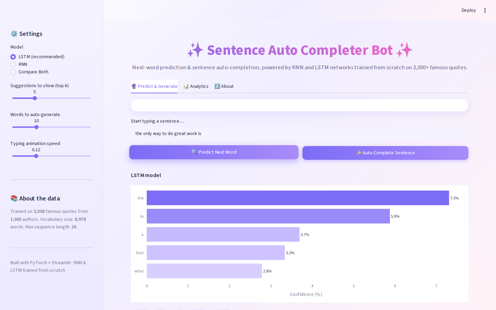
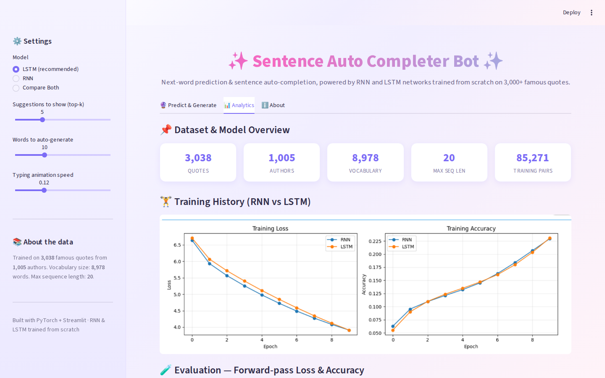

# ✨ Sentence Auto Completer Bot

A **production-ready** next-word prediction & sentence auto-completion app, built with **PyTorch** (RNN + LSTM, trained from scratch) and served through an animated, light-themed **Streamlit** UI.

Trained on 3,000+ famous quotes so it "talks" like a quote generator — start a sentence and let the model finish it.

---

## 🎬 Preview


*(Full-length video: `preview/demo_preview.mp4`)*

| Predict & Generate | Analytics dashboard |
|---|---|
|  |  |

More screenshots in [`preview/`](preview/): home screen, sentence generation, full analytics scroll, and the About tab.

---

## 🔮 Features

- **Next-word prediction** — type any sentence, get the top-k most likely next words with animated confidence bars.
- **Sentence auto-completion** — generates up to 30 words with a live "typing" animation, rendered as a quote card.
- **RNN vs LSTM** — pick either model, or **Compare Both** side by side.
- **Analytics dashboard** — dataset stats, the real RNN vs LSTM training curves, forward-pass loss/accuracy evaluation, parameter-count comparison, word-frequency & Zipf's-law plots, quote-length distribution, and top authors — all interactive (Plotly).
- **Light theme only**, with animated gradients, fade-ins, hover effects and a glowing quote card — no dark mode.
- 100% **CPU-friendly** — inference only, no GPU required, no training happens inside the app.

---

## 🗂️ Project Structure

```
Sentence Auto Completer Bot/
├── app.py                     ← Streamlit app (run this)
├── requirements.txt
├── .streamlit/config.toml     ← forces the light theme
├── models/
│   ├── rnn_model.pth          ← trained RNN weights
│   ├── lstm_model.pth         ← trained LSTM weights
│   ├── vocab.pkl              ← word_to_index / index_to_word
│   └── max_len.pkl
├── data/
│   └── qoute_dataset.csv      ← ~3,000 famous quotes
├── notebook/
│   └── quote_next_word_predictor.ipynb   ← full training + evaluation notebook (already executed)
├── graphs/                    ← training curves & analysis charts (used by the app + notebook)
└── preview/                   ← screenshots + demo video/gif
```

---

## 🚀 Getting Started

```bash
# 1. Create a virtual environment (recommended)
python -m venv venv
source venv/bin/activate      # Windows: venv\Scripts\activate

# 2. Install dependencies
pip install -r requirements.txt

# 3. Run the app
streamlit run app.py
```

The app will open at `http://localhost:8501`. The very first launch is a little slower because PyTorch has to load — after that it's instant (models & data are cached with `@st.cache_resource` / `@st.cache_data`).

---

## 🧠 How It Works

1. **Data** — quotes are lowercased and stripped of punctuation.
2. **Vocabulary** — the 10,000 most frequent words become integer ids (a hand-built vocabulary, since PyTorch has no `Tokenizer` class like Keras).
3. **Training pairs** — every quote is turned into growing `(words-so-far → next word)` examples (85K+ pairs).
4. **Models** — `Embedding → RNN/LSTM → Linear`, trained from scratch in PyTorch (see the notebook for the full training loop, loss curves, etc.).
5. **Inference (this app)** — loads the already-trained weights and only ever runs a forward pass.

The notebook in `notebook/` contains the complete, already-executed pipeline: data loading, cleaning, vocabulary building, model definitions, training (skipped by default since weights are provided — set `RETRAIN = True` to retrain), and a full evaluation/analysis section that generates every chart in `graphs/`.

---

## 🛠️ Tech Stack

`PyTorch` · `Streamlit` · `Plotly` · `Pandas` / `NumPy` · `Matplotlib` (notebook charts)

---

## 📊 Model Summary

| Model | Parameters | Notes |
|---|---|---|
| RNN  | ~1.81M | `Embedding(10000,50) → RNN(128) → Linear(10000)` |
| LSTM | ~1.88M | `Embedding(10000,50) → LSTM(128) → Linear(10000)` |

Exact loss/accuracy figures are computed live in the **Analytics** tab (forward pass over the trained weights) and in Section 19 of the notebook.
